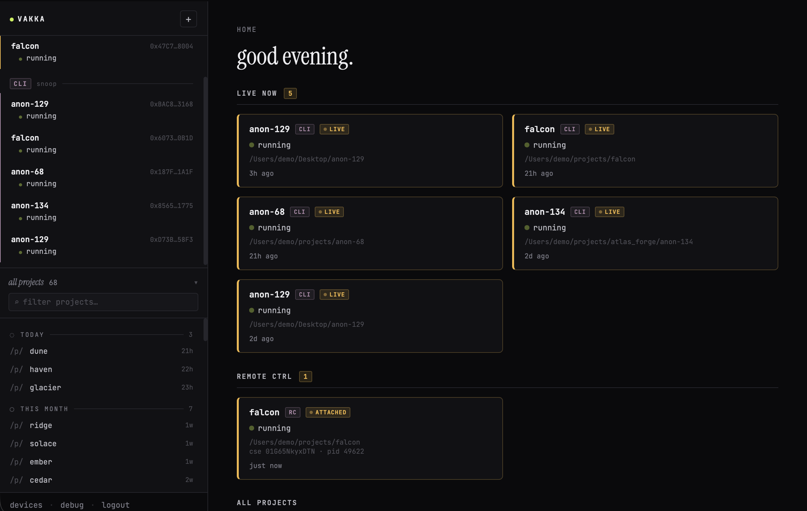

# Vakka

A self-hosted browser UI for Claude Agent SDK sessions and Claude Code Remote Control sessions. The terminal is fine for one agent. It stops being fine around the fourth one across three projects.

Vakka is a control plane for that: spawn agents per project, attach to ones already running in a terminal, watch their tool calls, answer their permission prompts, resume old conversations. One UI, localhost only, single user.

> Don't expose it to the internet.



## A note on the name

> **vakka** _(Old Norse, að)_, = vafka: *to stray, hover about; láta vakka við skipin* — "to hover about the ships."

That's the idea. Vakka hovers around your agents while they do the work — watching, surfacing what they're up to, stepping in when they need an answer. It doesn't sail the ship.

## What it does

- **Spawns** SDK sessions per project. History persists in SQLite.
- **Attaches to a running Claude Code session** in your terminal via a local mitmproxy hijack. CC keeps owning the terminal output; Vakka attaches a browser UI alongside it.
- **Resumes** prior sessions, both Vakka-spawned and external `~/.claude/projects/...` jsonl transcripts.
- **One UI** for permission prompts, multi-question prompts, plan-proposal review, and live message streaming.

Two transports, same UI:

| Mode | What it is |
|---|---|
| SDK-wrapper | Vakka spawns the SDK directly. Simplest path. |
| RC-attached | Vakka attaches to a running CC terminal session. The hijack mode. |

## Requirements

- macOS (Apple Silicon tested) or Linux. The broker auto-bootstrap is macOS/Homebrew only; on Linux see `infra/README.md`.
- [Bun](https://bun.sh) ≥ 1.2.
- [mosquitto](https://mosquitto.org/): `brew install mosquitto`. Started automatically on first run via `brew services`.
- For RC-attached mode only: [mitmproxy](https://mitmproxy.org/) (`brew install mitmproxy`). It intercepts Claude Code's HTTPS traffic locally so Vakka can drive an existing CC session.

## Quick start

```bash
bun install
bun run dev
```

Open http://127.0.0.1:3000 and start a session.

First run will:
- Create `./data/vakka.db`.
- Bootstrap a localhost-only mosquitto config under `~/Library/Application Support/vakka/mosquitto/` (macOS) and start the broker via `brew services`.
- Generate a local auth token. The first browser to load the UI gets pinned as the trusted client; later browsers have to be paired explicitly.

### Scripts

- `bun run dev`: full stack with file-watch reload.
- `bun run start`: full stack, no watch.
- `bun run build:frontend`: one-shot frontend build.
- `bun run dev:frontend`: frontend-only watch (useful for CSS iteration).
- `bun run dev:ui`: UI dev mode against a synthetic mock DB. No real agent.
- `bun test`: run the suite.
- `bun run check`: biome lint + format check.

## Configuration

All env vars are optional:

| Var | Default | Notes |
|---|---|---|
| `VAKKA_BIND` | `127.0.0.1` | Web bind address. Don't change this unless you understand what's being given up. |
| `VAKKA_WEB_PORT` | `3000` | Web port. |
| `VAKKA_DB_PATH` | `./data/vakka.db` | SQLite path. |
| `VAKKA_MQTT_HOST` | `127.0.0.1` | Broker host. |

Default permissions for spawned agents live in `config/default-permissions.json`. Per-session overrides happen from the UI.

Append `?demo=1` to any UI URL to redact project names, paths, and session ids for screenshots; `?demo=0` turns it off. Add `?demo_blur=1` to blur message bodies (hover to reveal).

## RC-attached mode

This is the more interesting transport. To drive a Claude Code terminal session from the browser:

1. `brew install mitmproxy`.
2. Run mitmproxy once and trust its CA cert from `~/.mitmproxy/`.
3. Launch CC under the Vakka wrapper (see `scripts/`).
4. The browser UI lists the live CC session under "Active sessions".

The mechanism is what it sounds like. mitmproxy intercepts CC's HTTPS traffic on localhost; the relay reads SSE events on the way back, injects user messages on the way out, and surfaces tool-use lifecycles in the browser. CC keeps owning the terminal. Vakka hovers alongside.

## Architecture, briefly

- `src/web`: Express + WebSocket. Serves the UI and the chat API.
- `src/manager`: manager process. Owns SDK spawn, MQTT subscription, message normalization, persistence.
- `src/relay`: CC RC relay. The bridge between mitmproxy-intercepted CC traffic and Vakka.
- `src/frontend`: Preact + signals. Single bundle, no SSR.
- `src/db`: bun:sqlite schema + queries. Source of truth is the `chat_messages` table.
- `src/shared`: types only, browser-safe.

The manager and web run as separate processes coordinated through mosquitto. `scripts/run.ts` is the supervisor.

## Status

Single user, localhost only. The auth model is "first browser to connect gets pinned; later ones have to be paired explicitly" — fine for a tool that lives on your laptop, not fine for anything else. Schema gets nuked when it changes (no migration code), so don't depend on data here surviving an update.

Issues and PRs welcome. Responses not guaranteed.

## License

MIT. See [LICENSE](./LICENSE).
